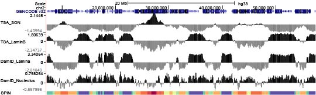
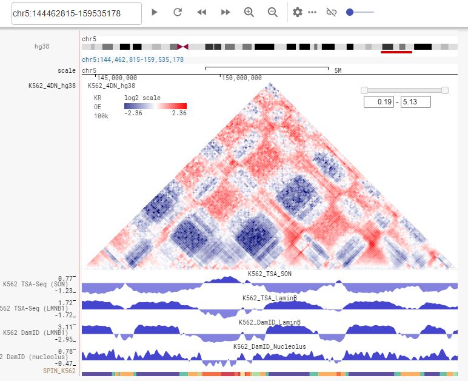

# SPIN
SPIN (Spatial Position Inference of the Nuclear genome) is a integrative computational method to identify genome-wide chromosome localization patterns relative to multiple nuclearcompartments using TSA-seq, DamID, and Hi-C data. 

## Required Packages
SPIN requires the following Python packages to be installed:
- Python (tested on version 3.6)
- `scikit-learn` (tested on version 0.22.2)
- `NumPy` 
- `SciPy`
- `pandas`
- `pickle`

[Juicer tools](https://github.com/aidenlab/juicer/wiki/Juicer-Tools-Quick-Start) is required to extract Hi-C data from [.hic files](https://github.com/aidenlab/juicer/wiki/Pre). Requires Java Runtime Engine  installed on your file system.


## Usage

After install all dependencies, run the following python command:

`python main.py -i <input_signal> --hic <hic_interactions> -w <window_size> -n <number_of_states> -o <output_path> -g <genome_bin> [--prev <previous_model>] [--save]`

The options:

- -i \<input_signal\> : 1D genomic measurements of nuclear organization. `input_signal` file should be a tab-separated text file where each line is a vector of 1D genomic measurements. For example (header not included):

| signal1 |    signal2 |  signal3    | signal4  |
|----------|-------------|--------------|----------|
|0.4209    |-0.3468      |-0.0405       |0.01026   |
|0.9098    |-0.7316      |-0.0961       |0.0224    |
|1.3589    |-1.0421      |-0.2001       |0.0229    |
|1.4688    |-1.1082      |-0.2716       |0.0105    |
|1.4552    |-1.1599      |-0.3605       |-0.0345   |
|1.3385    |-1.1504      |-0.3953       |-0.0727   |
| ...      | ...         | ...          | ...      |


- --hic \<hic_interactions\> : List of Hi-C interactions added as edges in the model. `hic_interactions` file should be a tab-separated text file where the first two columns are the index numbers of genomic bins (needs to be consistent with `genome_bin`) and the third column is edge weight (opitional). For example (header not included):

| bin1 | bin2 |  weight   |
|----------|----------|--------------|
|1         |7         |1.0           |
|3         |5         |1.0           |
|4         |20        |1.0           |
|1         |299       |1.0           |
|7         |312       |1.0           |
| ...      | ...      | ...          |


- -w \<window_size\> : Window size of each genome bin. Default = 100000

- -n \<number_of_states\> : Number of states to estimate for SPIN. Default = 5

- -o \<output_path\> : Output path.

- -g \<genome_bin\>: Genomic coordinates of each bin. `genome_bin` file should be a tab-separated text file where the first three columns are the genomic coordinates of each bin and the fourth column is the index number (starting from zero). For example (header not included):

| chr    | start  |  end   |index number|
|--------|--------|--------|----------|
|chr1    |0       |25000   |0         |
|chr1    |25000   |50000   |1         |
|chr1    |50000   |75000   |2         |
|chr1    |75000   |100000  |3         |
|chr1    |100000  |125000  |4         |
| ...    | ...    | ...    | ...      |

- --prev \<previous_model\>: (opitional) Load previously saved model.

- --save : (opitional) Save curent model to .pkl file.

Example:

`python main.py -i input_chr1.txt --hic Hi-C_chr1.txt -w 25000 -n 5 -m <mode> -o example_chr1 -g bin_chr1.bed --save`

Predicted states `state_n` can be found under `output_path` folder. To convert the results to bed format:

`merge2bed.sh genome_bin_file state_n output.bed`

## Visualization

The bed file can be manually uploaded as custom annotation tracks to UCSC genome browser for visualization. An additional header must be added as the first line of the file in the following format: 

`track name='<track_name>' description='<description>' itemRgb='On'`

Then go to a UCSC genome browser view, click the "add custom tracks" or "manage custom tracks" button below the tracks window. On the Add Custom Tracks page, load the annotation track data or URL for your custom track into the upper text box and the track documentation (optional) into the lower text box, then click the "Submit" button. 

It is recommended to use distinguishable colors for different states. For example:

| State  | itemRgb   |
|--------|-----------|
|State_1 |228,26,28  |
|State_2 |55,126,184 |
|State_3 |77,175,74  |
|State_4 |152,78,163 |
|State_5 |255,127,0  |
| ...    | ...       |

Additional BED fields can be added (with 9th column showing the color in RGB value). For example (header not included):

| chrom  | chromStart|  chromEnd |name | score | strand | thickStart | thickEnd | itemRgb |
|------|--------|--------|----------|------|--------|--------|----------|----------|
|chr1  | 0      | 725000 | State_1  |0     |  .     |0       |725000 | 102,194,165 |
|chr1  | 725000 | 875000 | State_2  |0     |  .     |725000  |875000 | 252,141,98  |
|chr1  | 875000 | 2550000| State_3  |0     |  .     |875000  |2550000| 141,160,203 |
|chr1  | 2550000| 2650000| State_2  |0     |  .     |2550000 |2650000| 252,141,98  |
|chr1  | 2650000| 2800000| State_1  |0     |  .     |2650000 |2800000| 102,194,165 |
|chr1  | 2800000| 2925000| State_2  |0     |  .     |2800000 |2925000| 252,141,98  |
| ...  | ...    | ...    | ...      |...   | ...    | ...    |...    | ...         |

Use the [bedToBigBed](http://hgdownload.soe.ucsc.edu/admin/exe/) utility to create a bigBed file.
 
`bedToBigBed input.bed chrom.sizes myBigBed.bb`

It is also recommended to use track bubs for more configurable custom annotations. See the [track hub](http://genome.ucsc.edu/goldenPath/help/hgTrackHubHelp.html) help page for more information.



In addition, tracks can be visualized on [Nucleome Browser](https://vis.nucleome.org/entry/). See the [Nucleome Browser](http://genome.ucsc.edu/goldenPath/help/hgTrackHubHelp.html) help page for more instructions.



## Data Availability

SPIN annotations for K562 can be found [here](https://drive.google.com/file/d/1gdwtrhTctddO9TCBXBaZpZFOAHWCUTli/view?usp=sharing).

## Citation

If you use SPIN in your work

```
@article{wang2020spin,
  title={SPIN reveals genome-wide landscape of nuclear compartmentalization},
  author={Wang, Yuchuan and Zhang, Yang and Zhang, Ruochi and van Schaik, Tom and Zhang, Liguo and Sasaki, Takayo and Peric-Hupkes, Daniel and Chen, Yu and Gilbert, David M and van Steensel, Bas and others},
  journal={bioRxiv},
  year={2020},
  publisher={Cold Spring Harbor Laboratory}
}
```
